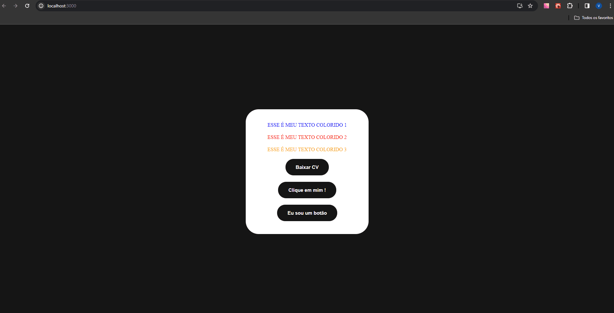

# Desafio de React Básico 

Este é um projeto de exemplo de um desafio básico em React. Ele consiste em criar parágrafos coloridos passando as cores por props e botões que, ao serem clicados, mostram a label dos mesmos em um alerta.

## Preview



## Configuração

1. **Clonando o repositório:**
   ```
   git clone https://github.com/Vinicius-b-oliveira/react-basico
   ```
2. **Instalando dependências:**
   ```
   npm install
   ```
   Este comando instalará todas as dependências necessárias para o projeto.

3. **Iniciando no navegador:**
   ```
   npm start
   ```
   Este comando criará um servidor local para o projeto.

## Como Usar

Este desafio básico em React permite interagir com parágrafos coloridos e botões. Ao clicar nos botões, você verá um alerta com a label do botão clicado.

Divirta-se experimentando diferentes cores e interagindo com os botões! 🚀